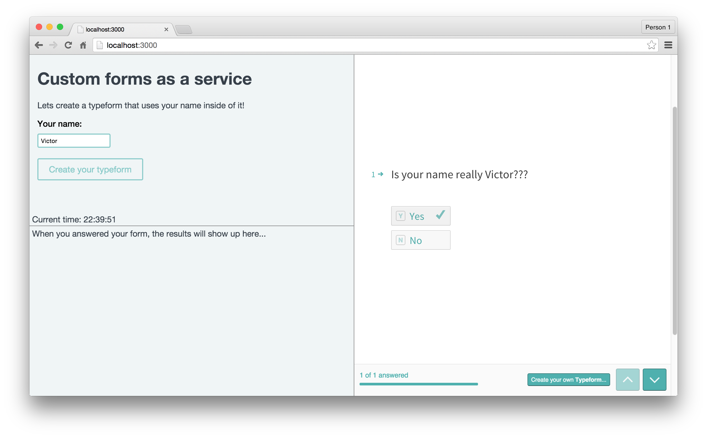

# Sorry, Typeform I/O will be deprecated soon. Please visit https://developer.typeform.com/ to discover our new developer products

## Typeform I/O - NodeJS Bootstrap

This is a bootstrap application that you can use to kickstart development when
you want to use Typeform I/O. It's very basic at the moment and does not do
a lot but it's useful to look at when you want to know how to use Typeform I/O
in a node environment. Basically what the application does is asking for your name, create a form containing that name and show all the results the application received from Typeform.

## Requirements

* NodeJS version 0.11 or later
* An working internet connection (for giving you an public dns address via [Localtunnel](https://github.com/localtunnel/localtunnel) and rendering of the forms)
* A Typeform I/O API-key. [Signup here if you haven't got one already](https://io1.typeform.com/to/HMLOBl)

## Installing

* Clone this project into your local computer
* run `npm install` inside the cloned project

## Running

To run this application, you'll need to have a Typeform I/O API-key already. If
you don't have it, get it by filling out [this signup form](https://io1.typeform.com/to/HMLOBl) 

* Have your API-key ready and run `TYPEFORM_API_KEY=YOUR_KEY npm start`
* Visit http://localhost:3000 in your browser

## Where to get help

* [Open up an issue](https://github.com/TypeformIO/Node-Bootstrap/issues/new) in this repository
* In our official Slack channel ( [Signup](https://io1.typeform.com/to/sHP9NQ) )
* Send email to [support@typeform.io](mailto:support@typeform.io)

## Contributing

If you want to contribute, just follow the general code style and code on! We
love pull requests.

If you're unsure if we're gonna merge it or not, create an issue before and we'll
discuss it.

## License
The MIT License (MIT)

Copyright (c) 2015 Typeform

Permission is hereby granted, free of charge, to any person obtaining a copy
of this software and associated documentation files (the "Software"), to deal
in the Software without restriction, including without limitation the rights
to use, copy, modify, merge, publish, distribute, sublicense, and/or sell
copies of the Software, and to permit persons to whom the Software is
furnished to do so, subject to the following conditions:

The above copyright notice and this permission notice shall be included in
all copies or substantial portions of the Software.

THE SOFTWARE IS PROVIDED "AS IS", WITHOUT WARRANTY OF ANY KIND, EXPRESS OR
IMPLIED, INCLUDING BUT NOT LIMITED TO THE WARRANTIES OF MERCHANTABILITY,
FITNESS FOR A PARTICULAR PURPOSE AND NONINFRINGEMENT. IN NO EVENT SHALL THE
AUTHORS OR COPYRIGHT HOLDERS BE LIABLE FOR ANY CLAIM, DAMAGES OR OTHER
LIABILITY, WHETHER IN AN ACTION OF CONTRACT, TORT OR OTHERWISE, ARISING FROM,
OUT OF OR IN CONNECTION WITH THE SOFTWARE OR THE USE OR OTHER DEALINGS IN
THE SOFTWARE.
